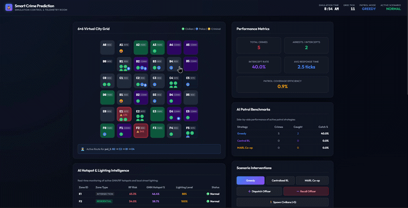
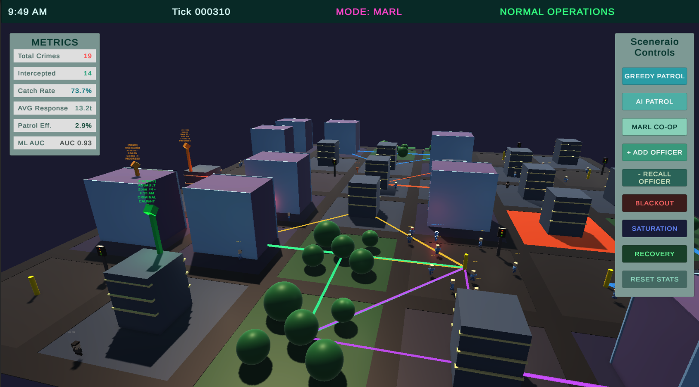
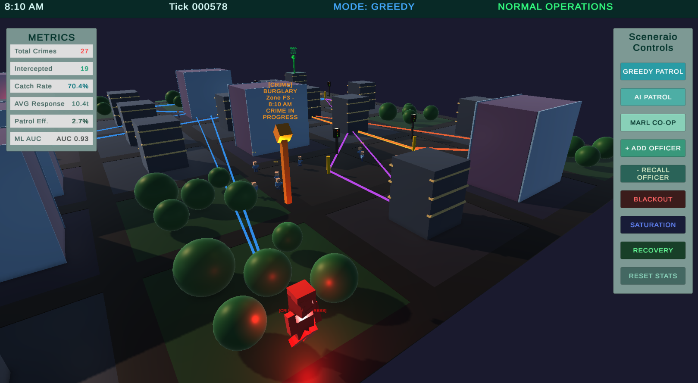
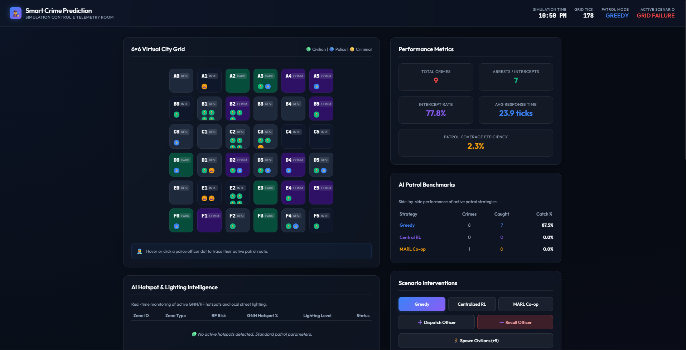
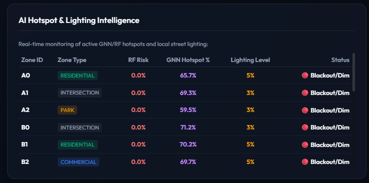

# SmartCrimeAI: Predictive Crime Simulation and Patrol Optimization

SmartCrimeAI is an interactive multi-agent simulation platform designed to model urban crime dynamics and optimize police patrol routing. The system couples a real-time Unity 3D frontend with a Python-based machine learning and reinforcement learning backend.

By combining tabular predictive modeling (Random Forest), spatial graph neural networks (GCN/GNN), and multi-agent reinforcement learning (MARL), the platform demonstrates how predictive policing and intelligent patrol coordination can reduce response times and mitigate hotspots.

When the Python backend is running, it hosts a built-in, interactive web dashboard serving real-time analytics, maps, and control panels directly at your localhost URL: `http://localhost:8000/`

---

## Detailed System Features

### Discrete-Agent Simulation
The simulation loop runs a discrete-time model containing three primary agent types whose behaviors are driven by dynamic environmental factors:
* **Civilian Agents:** Civilians commute between residential, commercial, park, and intersection zones. They follow a diurnal schedule with morning (6:00 AM to 9:00 AM) and evening (5:00 PM to 8:00 PM) peaks to simulate rush hours. They are highly sensitive to crime: witnessing a crime triggers a flee state, which can propagate to neighboring civilians via a herd-fleeing social influence mechanic.
* **Criminal Agents:** Criminals actively scout zones. They calculate a real-time opportunity score based on poor lighting, low police presence, and civilian density. If a zone exceeds their opportunity threshold, they commit a crime (e.g. theft, assault, vandalism, or burglary). If caught by the police, they lay low for a set duration to simulate penalization.
* **Police Agents:** Police officers patrol the city grid and respond to dispatches. When a crime is reported, they enter a high-priority dispatch state, calculating the shortest Manhattan distance path to the incident zone to intercept the criminal within a tight response window.

### Dual Machine Learning Predictors
To model crime risk, the backend trains two separate models in the background:
* **Random Forest Classifier (Tabular):** Generates high-resolution, per-zone crime probability scores. It evaluates a flat feature vector containing current lighting levels, active civilian and police counts, neighbor average risks, and rolling historical crime counts. A secondary Ridge regressor predicts a continuous proxy of the time-until-crime window.
* **Graph Neural Network (Spatial GNN):** Treats the city grid as a spatial graph where zones are nodes and adjacent streets are edges. Built using a pure PyTorch 3-layer Graph Convolutional Network (GCN) with symmetric normalization and batch normalization, it groups historical crime logs into hourly windows (12 ticks). It ranks zones based on crime frequency and classifies the top 20 percent of zones as spatial hotspots, correcting class imbalance using class-weighted loss.

### Multi-Agent Patrol Optimization
The simulation supports multiple patrol routing strategies to allow direct performance comparisons:
* **Greedy Patrol Optimizer:** Dynamically sorts all zones by predicted risk, assigning the highest-risk zones as primary routes to available officers while ensuring routes remain disjoint.
* **Reinforcement Learning (RL/MARL):** Features both a centralized PPO model (using Stable-Baselines3) and a decentralized Multi-Agent Reinforcement Learning (MARL) coordinator. The MARL coordinator trains multiple police units using custom observation spaces (including zone risk, police coverage, and path overlap) to achieve collaborative city-wide coverage without redundant patrolling.

### Real-Time Visualization
The Unity 3D frontend provides immersive visual feedback:
* **Dynamic Heatmaps:** Renders glowing real-time heatmaps on street surfaces representing active risk levels.
* **Patrol Route Lines:** Draws color-coded paths for each active police unit to visualize their planned routes.
* **Day-Night Cycles:** Automatically transitions the scene lighting based on the backend simulated hour, dimming street lamps and triggering night-time lighting reductions in parks and intersections.
* **Live KPI Dashboard:** Updates live charts showing simulated metrics such as overall catch rate, average police response times, and patrol efficiency.

### Automated Report Generation
Whenever the background retraining thread triggers (every 50 new crime events), the system automatically validates the models:
* Generates and saves a modern suite of analytical charts (including Confusion Matrices, ROC Curves, Precision-Recall Curves, and Feature Importance rankings) to the `output/reports` directory.
* Compiles a running training history in JSON format, allowing users to inspect model accuracy progression over time.

---

## Visual Previews

### Simulation Demos (GIFs)

#### Unity 3D Frontend - Daylight Commutes


#### Unity 3D Frontend - Night/Blackout Scenario


#### Localhost Web Dashboard


---

### Unity 3D Frontend Screenshots

#### Overview and Agent Commutes


#### Active Dispatches and Patrol Routes


---

### Localhost Web Dashboard Screenshots

#### Live Analytics Panel


#### Model Retraining and Performance Reports


---

## Setup and Installation

### Option 1: Standalone Unified Release (Easiest)

You can download a pre-packaged standalone release directly from the **Releases** section on GitHub. 

* The release zip bundles the compiled Unity player and a standalone backend executable (`SmartCrimeAI-Backend.exe`) next to each other.
* Simply extract the zip and run the Unity executable. It will launch and manage the backend process automatically.

### Option 2: Local Python Execution (For Development)

Ensure you have Python 3.10 installed on your system.

1. Navigate to the backend directory:
   ```bash
   cd SmartCrimeAI/backend
   ```

2. Create and activate a virtual environment:
   ```bash
   python -m venv venv
   # On Windows:
   .\venv\Scripts\activate
   # On macOS/Linux:
   source venv/bin/activate
   ```

3. Install the required dependencies:
   ```bash
   pip install -r requirements.txt
   ```

4. Run the backend orchestrator:
   ```bash
   python main.py
   ```
   The backend API will start running locally at `http://localhost:8000`. You can access the built-in interactive web dashboard directly at `http://localhost:8000/` and the interactive API documentation at `http://localhost:8000/docs`.

5. Open Unity Hub, add the project located in `SmartCrimeAI/crimesimfrontend`, and open `Assets/Scenes/Main.unity`. Press **Play** in the editor to connect to your local backend.

---

## Quickstart: Jumpstarting with Pre-trained Models

### The Startup Training Delay
If you perform a fresh install or checkout without an existing `output` folder, the backend will detect that no pre-trained reinforcement learning (RL/MARL) weights or crime datasets exist. 
* To ensure the system is fully functional, **the backend will automatically train these reinforcement learning policies from scratch on startup.**
* This initial training phase takes approximately **2 to 3 minutes** to load. During this time, the console will display training updates, and the server will wait to accept frontend requests until training completes.

### Bypassing the Delay
To skip this initial startup training delay and bypass the time required to accumulate historical crime logs, you can drop in a pre-trained `output` directory:

1. Download the pre-trained `output` directory from Google Drive:
   * **[Google Drive link placeholder for pre-trained output folder]**
2. Extract the downloaded folder.
3. Place the `output` directory directly inside the `SmartCrimeAI/backend/` folder (replacing any empty `output` folder).
4. Run the Python backend:
   ```bash
   python main.py
   ```
The server will boot up instantly (in under 2 seconds) with thousands of pre-logged rows and fully compiled models. You can immediately switch the game to AI or MARL patrol modes and inspect fully populated background reports.
